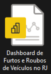
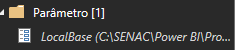
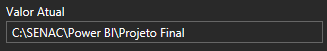

# 
  Projeto Nossa Livraria - Power BI

> ℹ️ **NOTE:** Projeto desenvolvido no curso de Análise de dados Com Power BI para plataforma [RioOn](https://rioon.rio.br/) em parceria com o [Senac RJ](https://www.rj.senac.br/).

  

  

    Demonstração do Projeto

## ❗ Objetivos do Projeto

- Automatizar a coleta e análise de dados
- Fornecer insights valiosos de forma rápida e acessível, como o ticket médio por filial, vendas mensais por gênero e autor, e desempenho comparativo de filiais.

## 📂 Bases de Dados

- [Dados da Livraria](https://github.com/vivianebatista92/Projeto-BI-Nossa-Livraria/blob/main/base_dados/BaseDeVendasDeLivros2.xlsm)

## 🔧 Ferramentas

 

## ✏️ Atividades Propostas

|   **Atividades** |
| ------------------------------------------------------------------------------------------------------------------------------------------------------------------------------------------------------------------------------------------------------------------------------ |
| <li> Importar os dados </li> |
 | <li> ETL dos dados: limpar as colunas desnecessárias e os dados redundantes </li>|
 | <li> Cria a tabela dCalendario com linguagem M </li>|
 | <li> Relacionar as tabelas entre si </li>|
 | <li> Criar segmentações </li>|

 ## 📈 Análises Desejadas

|   **Análises Realizadas com Medidas DAX** |
| ------------------------------------------------------------------------------------------------------------------------------------------------------------------------------------------------------------------------------------------------------------------------------ |
| <li> Vendas por Gênero Literário </li> |
 | <li> Desempenho de Autor e Editora </li>|
 | <li> Análise de Vendas por Filial </li>|
 | <li> Desempenho da Equipe de Vendas </li>|
 | <li> Análise Temporal das Venda\s </li>|

 ## ❓ Utilização do Projeto

- O arquivo do Power BI, por possuir uma tabela que não é hospedada em algum site, para funcionar, deve seguir alguns passos:

|   Ação   | Imagem                                                                                                                                                                                                                                                                         |
| :------: | ------------------------------------------------------------------------------------------------------------------------------------------------------------------------------------------------------------------------------------------------------------------------------ |
|  Ao baixar a pasta do projeto, abra o Power BI    | 
|  Clicar em Transformar Dados:  |  |
| Clicar em Local Base | |
| Verificar o caminho no seu computador de onde está a tabela DP e copiar |  |
| Colar esse caminho no campo valor do Local Base |  |

#

